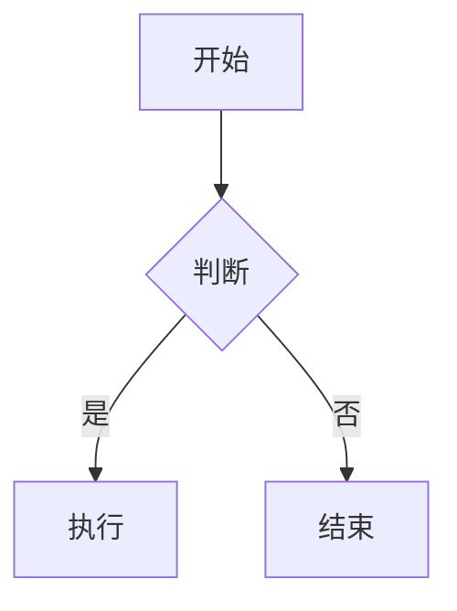
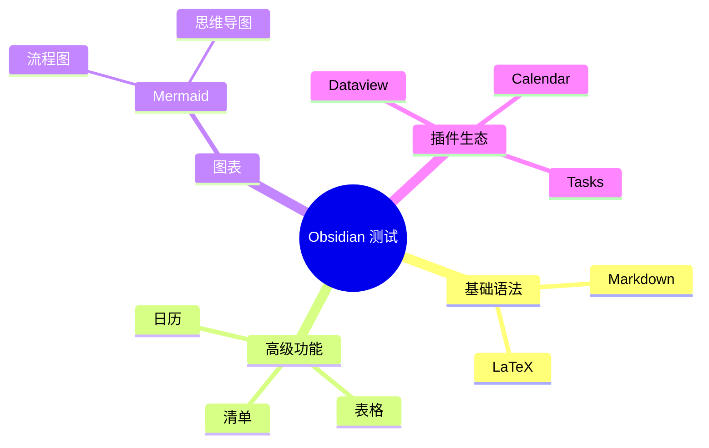
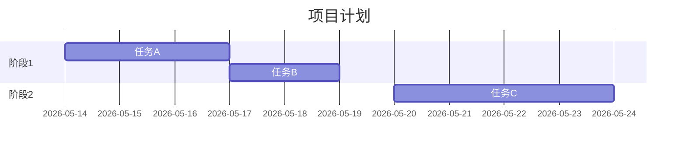

---
tags:
  - 测试
  - obsidian
  - markdown
date: 2026-05-14
cssclass: test-page
---

# Obsidian 功能全面测试

## 1. Markdown 基础语法
这是**粗体**，*斜体*，***粗斜体***，~~删除线~~，==高亮==。  
行内代码 `print("Hello")`，链接：[Obsidian官网](https://obsidian.md)。

### 列表
- 无序列表项
    - 嵌套无序
1. 有序列表
    1. 嵌套有序

### 任务列表（待办清单）
- [x] 完成测试文档
- [x] 检查 LaTeX
- [ ] 验证 Mermaid 图表
- [ ] 测试日记链接

## 2. 块引用与脚注
这里是一段文字[^1]。  
可以在段落末尾添加 ^block-id 创建可引用块。例如：这是一个可以被引用的重要段落。 ^my-block

- 引用该块：[[#^my-block]]
- 嵌入该块：![[#^my-block]]

[^1]: 这是脚注的详细内容。

## 3. 表格
| 功能 | 状态 | 备注 |
|------|------|------|
| Markdown | ✅ 正常 | 基础语法 |
| LaTeX | ✅ 正常 | 数学公式 |
| Mermaid | ✅ 正常 | 图表渲染 |
| 日历 | ⚠️ 需开启日记插件 | 日记笔记 |
| 思维导图 | ✅ 正常 | Mermaid mindmap |

## 4. LaTeX 公式
行内公式：$e^{i\pi} + 1 = 0$  

块级公式：
$$
\sum_{n=1}^{\infty} \frac{1}{n^2} = \frac{\pi^2}{6}
$$

矩阵示例：
$$
\begin{pmatrix}
a & b \\
c & d
\end{pmatrix}
$$

## 5. 代码块
```python
def hello():
    print("Hello, Obsidian!")
```

## 6. Callout 标注
> [!note] Note
> 这是一个普通的提示块。
>>也可以嵌套

> [!abstract] Abstract
> 这是摘要说明，可以用 summary 或 tldr。

> [!info] Info
> 信息提示块。

> [!todo] Todo
> 待办事项提醒。

> [!tip] Tip
> 小技巧或重点提示，也可以写成 hint 或 important。

> [!success] Success
> 成功/完成提示，也可以写成 check 或 done。

> [!question] Question
> 常见问题或疑问，也可以写成 help 或 faq。

> [!warning] Warning
> 警告提醒，也可以写成 caution 或 attention。

> [!failure] Failure
> 失败或缺失提示，也可以写成 fail 或 missing。

> [!danger] Danger
> 严重错误提示，也可以写成 error。

> [!bug] Bug
> Bug 报告。

> [!example] Example
> 示例说明。

> [!quote] Quote
> 引用内容，也可以写成 cite。
## 7. 内部链接与嵌入
- 链接到笔记：[[未创建笔记]]
- 使用别名：[[未创建笔记|显示为别名]]
- 链接到标题：[[#Obsidian 功能全面测试]]
- 嵌入图片：![[example.png]]（需图片文件）
- 嵌入音频：![[audio.mp3]]
- 嵌入PDF：![[document.pdf]]

## 8. 标签
#obsidian #测试/高级  
支持嵌套标签与标签面板。

## 9. 注释
%% 这是 Obsidian 的注释，在阅读视图中不可见 %%

## 10. Mermaid 图表

### 流程图


### 思维导图 (Mindmap)


### 甘特图（可用于模拟日历/时间轴）


## 11. 日历功能（日记）
- 今日日记链接：[[2026-05-14]] （需开启“日记”核心插件）
- 模板变量（仅在模板中生效）：{{date:YYYY-MM-DD}} {{time:HH:mm}}
- 配合 Calendar 社区插件可获得可视日历视图。

## 12. YAML 属性
页面顶部的 `tags`、`date`、`cssclass` 等属性可被 Dataview 查询。
示例查询（需 Dataview 插件）：
```dataview
TABLE tags, date
FROM #obsidian
```

## 13. 分隔线与转义
---
文末分割线。  
如果想显示 Markdown 符号而不生效，使用反斜杠：\*这不是斜体\*。

