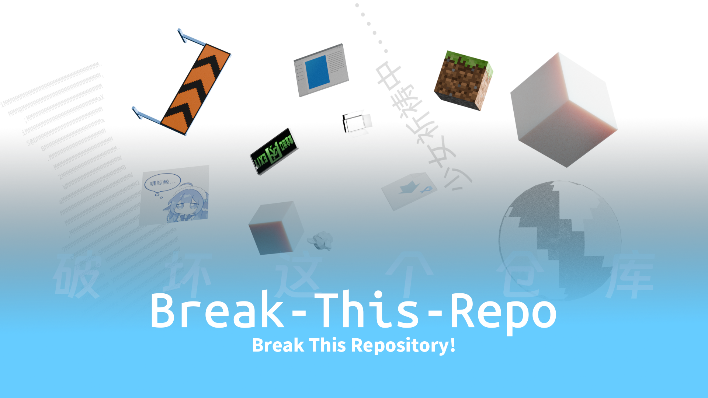

<h1 align="center">
  
    Break This Repository!    破坏这个仓库！
	

	    
	    
	    
	    
	 
	    
	    
	    
	    
	    </a>
	

</h1>
# 卧槽了哪里来的设证玩意啊😓不怕似吗😓
> [!CAUTION]
> This repository automatically merges pull requests without conflicts.
> 
> Please note that the `.github` directory is protected.
> 
> 这个仓库会自动合并没有冲突的拉取请求。
> 
> 请注意，`.github` 目录是受保护的。

---
