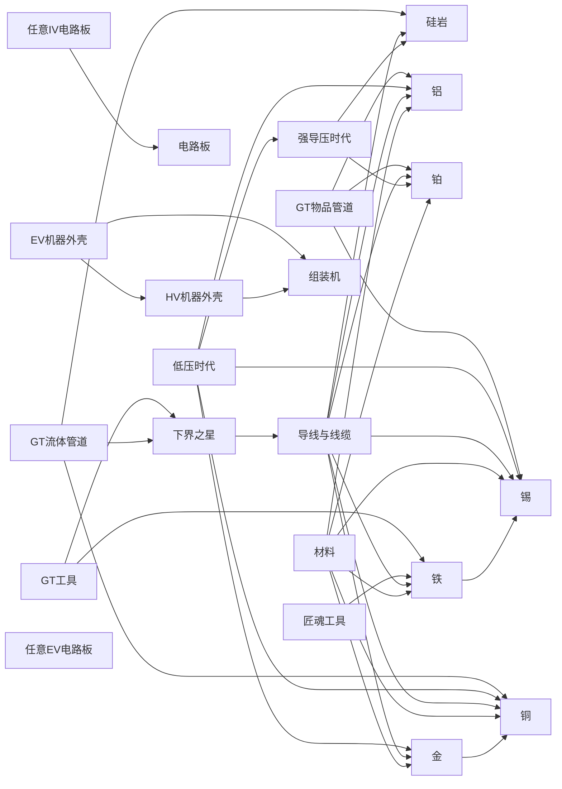

# 细胞连接图

把知识库里条目的互链关系画成一张图。生成器：`tools/make_graph.py`（纯标准库，无 CDN）。

## 文件

| 文件 | 说明 |
|---|---|
| `graph.svg` | 矢量图（798 节点 / 22000 边），可打印、可嵌网页 |
| `graph.html` | 查看页，内嵌 SVG，双击即可看 |
| `graph.json` | `{nodes, links}`，喂给 d3 / cytoscape / Gephi |
| `GRAPH.md` | 本文件 |

## 重新生成

```bash
python kbweb/build_site.py     # 先产出 titles.tsv / graph.edges.tsv
python tools/make_graph.py     # 默认取度数最高的 700 个节点
python tools/make_graph.py --nodes 1500 --edges 40000 --label-top 120
```

> 图密度取决于是否安装了维基 HTML 镜像（见 README）。
> 只有纯文字数据时，链接边很少，图会显得稀疏；装上镜像后可达 20 万条边。

## Mermaid 版（GitHub 原生渲染）

GitHub 不提供 Obsidian 那样的内容链接图，但它会渲染 Markdown 里的 Mermaid。
下面是度数最高的 22 个条目的局部图：


