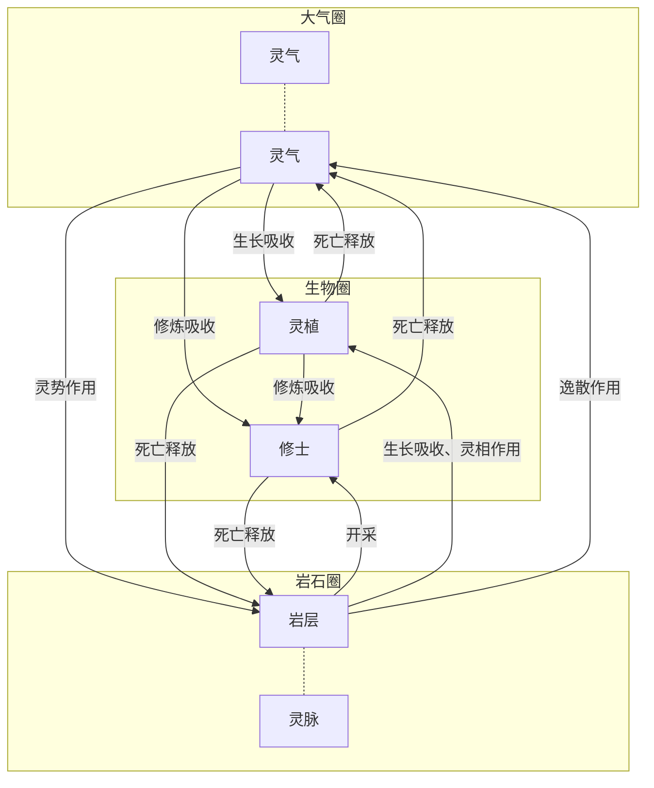

```mermaid
graph TD
    subgraph 大气圈
        %%direction LR
        灵气[灵气]
        大气[大气]
        
        灵气 -.- 大气[灵气]
    end

    subgraph 生物圈
        %%direction LR
    
        灵植[灵植]
        修士[修士]
    end
    
    subgraph 岩石圈
        %%direction LR
        岩层[岩层]
        
        岩层 -.- 灵脉[灵脉]
    end

    大气 -->|生长吸收|灵植
    大气 -->|修炼吸收|修士
    大气 -->|灵势作用|岩层
  
    灵植 -->|修炼吸收|修士
    灵植 -->|死亡释放|大气
    灵植 -->|死亡释放|岩层
    修士 -->|死亡释放|大气
    修士 -->|死亡释放|岩层
  
    岩层 -->|开采|修士
    岩层 -->|生长吸收、灵相作用|灵植
    岩层 -->|逸散作用|大气

```