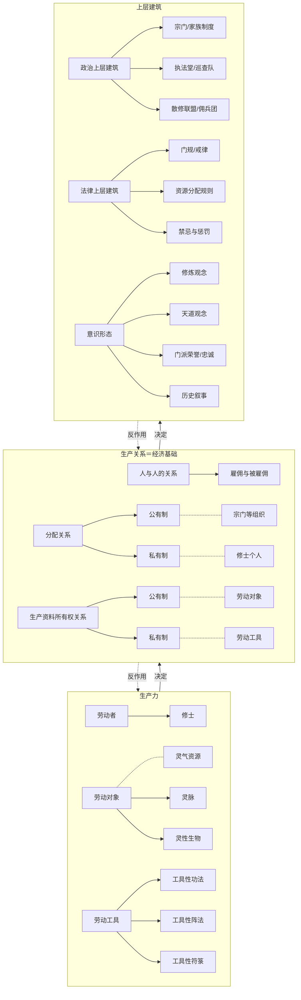

```mermaid
    graph TD
        subgraph 生产力
            direction LR
            劳动者[劳动者]
            劳动者 --> 修士[修士]
            
            劳动对象[劳动对象]
            劳动对象 -.- 资源[灵气资源]
            劳动对象 --> 灵脉[灵脉]
            劳动对象 --> 灵性生物[灵性生物]
            %%灵性生物包括灵植与灵兽
            
            劳动工具[劳动工具]
            劳动工具 --> 工具性功法[工具性功法]
            劳动工具 --> 工具性阵法[工具性阵法]
            劳动工具 --> 工具性符箓[工具性符箓]
        end
        
        subgraph 生产关系[生产关系＝经济基础]
            direction LR
            人与人的关系[人与人的关系]
            人与人的关系 --> 雇佣与被雇佣[雇佣与被雇佣]
            
            分配关系[分配关系]
            分配关系 --> 分配公有制[公有制]
            分配关系 --> 分配私有制[私有制]
            分配公有制 -.- 组织[宗门等组织]
            分配私有制 -.- 个人[修士个人]

            所有权关系[生产资料所有权关系]
            所有权关系 --> 所有权公有制[公有制]
            所有权关系 --> 所有权私有制[私有制]
            所有权公有制 -.- 劳动_对象[劳动对象]
            所有权私有制 -.- 劳动_工具[劳动工具]
        
        end
        
        subgraph 上层建筑
            direction LR
            政治上层建筑[政治上层建筑]
            政治上层建筑 --> 宗门体系[宗门/家族制度]
            政治上层建筑 --> 执法机构[执法堂/巡查队]
            政治上层建筑 --> 散修组织[散修联盟/佣兵团]

            法律上层建筑[法律上层建筑]
            法律上层建筑 --> 门规戒律[门规/戒律]
            法律上层建筑 --> 资源分配规则[资源分配规则]
            法律上层建筑 --> 禁忌与惩罚[禁忌与惩罚]

            意识形态[意识形态]
            意识形态 --> 修炼观念[修炼观念]
            意识形态 --> 天道观念[天道观念]
            意识形态 --> 门派荣誉[门派荣誉/忠诚]
            意识形态 --> 历史叙事[历史叙事]
    end
        
        生产力 -->|决定|生产关系
        生产关系 -.->|反作用|生产力
        生产关系 -->|决定|上层建筑
        上层建筑 -.->|反作用|生产关系

```