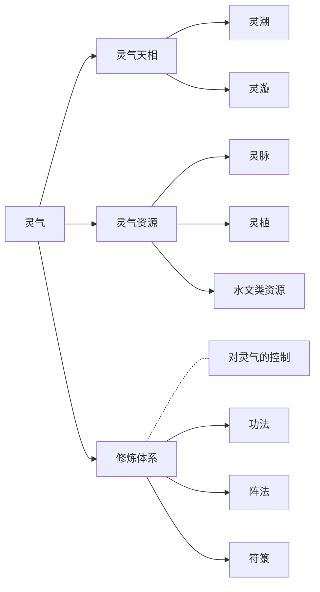

```mermaid
graph LR
  灵气[灵气]  
  %% root node
  
  灵气 --> 天相[灵气天相]
  灵气 --> 资源[灵气资源]
  灵气 --> 修炼[修炼体系]
  
  天相 --> 灵潮[灵潮]
  天相 --> 灵漩[灵漩]
  
  资源 --> 灵脉[灵脉]
  资源 --> 灵植[灵植]
  资源 --> 灵水[水文类资源]
  
  修炼 -.- 修炼def[对灵气的控制]
  修炼 --> 功法[功法]
  修炼 --> 阵法[阵法]
  修炼 --> 符箓[符箓]

```